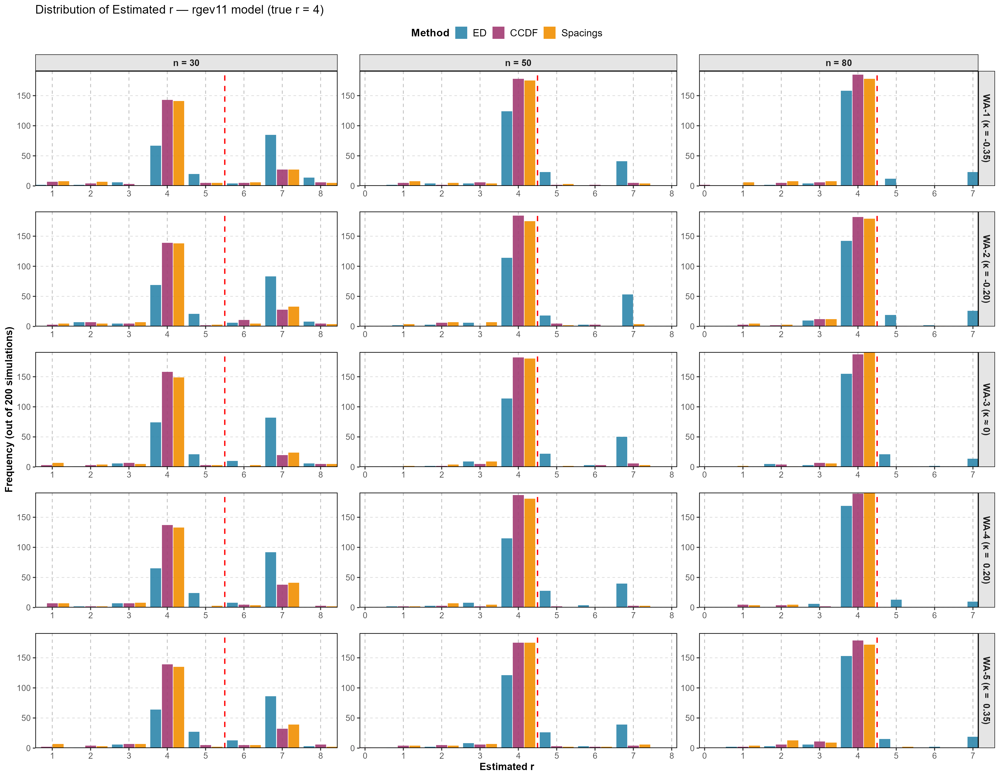
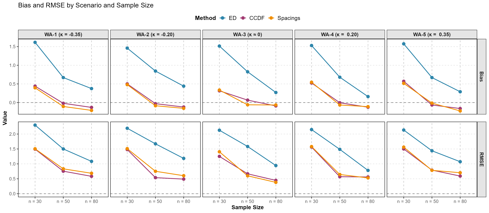

# selectrgev

**R package for selecting the optimal number of r-largest order statistics using GEV-based models.**

[](https://www.gnu.org/licenses/gpl-3.0)

---

## Overview

`selectrgev` implements sequential goodness-of-fit (GOF) procedures to automatically determine the optimal number *r* of r-largest order statistics for extreme value analysis. Two GEV-based models are supported:

| Model | Function | Description |
|-------|----------|-------------|
| RGEV | `rsel.rgev()` | Stationary GEV for r-largest |
| RGEV11 | `rsel.rgev11()` | Nonstationary GEV with linear location trend |

Three GOF test methods are available: `"ed"` (energy distance), `"ccdf"` (complementary CDF), and `"spacing"`.

---

## 🆕 Update (31 Aug 2026) — Main program: `rsel.rgev.SeqStop()`

The code has been updated. The **main program is now `rsel.rgev.SeqStop()`**
(`R/rsel.rgev.SeqStop.R`), which selects the optimal *r* by sequential
goodness-of-fit testing with stopping rules (raw p-values, then **ForwardStop**
and **StrongStop** adjusted for sequential multiple testing).

```r
rsel.rgev.SeqStop(xdat, sigL = 0.05, num_inits = 10,
                  method = c("ed", "ccdf", "spacing"),
                  test = "cvm", pplot = FALSE)
```

Example with the included Sancheong rainfall data:

```r
library(selectrgev)

data(sancheong)
xdat <- na.omit(sancheong[, 2:21])

rsel.rgev.SeqStop(xdat, sigL = 0.05, method = "ed")
rsel.rgev.SeqStop(xdat, sigL = 0.05, method = "ccdf")
rsel.rgev.SeqStop(xdat, sigL = 0.05, method = "spacing", pplot = TRUE)
```

**Return value:** a list with `method`, `rsel` (selected r), and `result`
(per-r table of p-values, ForwardStop, StrongStop, and parameter estimates).

Files added or updated in this release:

| File | Status | Note |
|------|--------|------|
| `R/rsel.rgev.SeqStop.R` | **new — main program** | Sequential selection with stopping rules |
| `R/rccdf.gof.new.R` | new | Conditional CCDF GOF transform (`rccdf.gof.new()`) |
| `R/spacing.gof.rgev.R` | new | Spacing GOF transform (`spacing.gof()`) |
| `R/rgev.fit.park.R` | updated | Tuned default `ntry` values |
| `R/rk3d.fit.park.R` | updated | Tuned defaults and parameter bounds |

The full changelog is in [`NEWS.md`](NEWS.md). Earlier versions of every file
remain available in the git history (open a file on GitHub and click
**History**), and each release is archived under
[Releases](https://github.com/Pjihong/select-r-ccdf/releases).

---

## Installation
```r
# Install from GitHub
# install.packages("remotes")
remotes::install_github("Pjihong/select-r-ccdf")
```

**Dependencies** (installed automatically):
```r
install.packages(c("goftest", "Rsolnp", "lmomco", "eva"))
```

---

## Quick Start

### Stationary model (RGEV)
```r
library(selectrgev)
library(eva)

set.seed(42)
xdat <- gevrSim(n = 50, r = 8, gumbel = TRUE)  # simulate r-largest data

result <- rsel.rgev(xdat, method = "ed", sigL = 0.05)
cat("Selected r =", result$r.sel, "\n")
cat("MLE (mu, sigma, kappa) =", result$mle, "\n")
```

### Nonstationary model (RGEV11)
```r
library(selectrgev)

# True parameters: (mu0, mu1, sigma0, sigma1, kappa)
para <- c(0, 0.1, 1, 0.02, -0.1)
sim  <- ran.rgev11(para, nsample = 50, rlarg = 8)
xdat <- sim$xdat

result <- rsel.rgev11(xdat, model = "rgev11",
                      method = "ed", sigL = 0.05)
cat("Selected r =", result$r.sel, "\n")
```

---

## Main Functions

### `rsel.rgev()`
```r
rsel.rgev(xdat, sigL = 0.05, num_inits = 5,
          method = c("ed", "ccdf", "spacing"),
          seq.cut = TRUE, qqplot = FALSE)
```

### `rsel.rgev11()`
```r
rsel.rgev11(xdat, model = "rgev11", sigL = 0.05,
            method = c("ed", "ccdf", "spacing"),
            num_inits = 15, seq.cut = TRUE, qqplot = FALSE)
```

| Argument | Description |
|----------|-------------|
| `xdat` | Matrix (n × maxr) of r-largest order statistics |
| `sigL` | Significance level (default 0.05) |
| `method` | GOF test: `"ed"`, `"ccdf"`, or `"spacing"` |
| `num_inits` | Random initialisations for MLE |
| `seq.cut` | Stop at first rejection if `TRUE` |
| `qqplot` | Draw Q-Q plots if `TRUE` |

**Return value:** A list with `r.sel` (selected r), `mle` (parameter estimates), `pval` (p-values), and `result` (full matrix).

---

## Helper / Utility Functions

| Function | Description |
|----------|-------------|
| `rgev.fit.park()` | MLE for stationary RGEV |
| `rgev11.fit.park()` | MLE for RGEV11 (nonstationary) |
| `rk3d.fit.park()` | MLE for 3-parameter extended model |
| `ran.rgev11()` | Simulate data from RGEV11 |
| `contam_rlosr()` | Generate contaminated r-largest samples |
| `gevrSeqTests.park()` | Sequential GOF tests (energy distance) |

---

## Example: Simulation Study

See `inst/examples/rsel_gev11_simulation.R` for a full Monte Carlo simulation study evaluating selection accuracy under various shape parameters and sample sizes.
```r
# Run the simulation example
example_path <- system.file("examples", "rsel_gev11_simulation.R",
                             package = "selectrgev")
source(example_path)
```

---

## 📊 Simulation Results

### Setup

The simulation study evaluates the r-selection accuracy of three methods under the **RGEV11** (nonstationary) model with the following settings:

| Item | Value |
|------|-------|
| Model | `rgev11` |
| True r | 4 |
| Sample sizes (n) | 30, 50, 80 |
| Shape parameter (κ) | −0.35, −0.20, ≈ 0, 0.20, 0.35 |
| Replications | 200 |
| Contamination | `contam_rlosr()`, mixp = 0.5 |

The five κ scenarios correspond to heavy-tailed (negative κ) to short-tailed (positive κ) distributions, covering a wide range of practical conditions in extreme value analysis.

### Figure 1 — Distribution of Estimated r



> The red dashed line marks the true r value (r = 4).  
> Methods: **ED** (blue) · **CCDF** (purple) · **Spacings** (orange).  
> x-axis: estimated r · y-axis: frequency out of 200 simulations.  
> Rows: κ scenario · Columns: sample size (n = 30, 50, 80).

### Figure 2 — Bias and RMSE Summary



> Bias (top) and RMSE (bottom) of the selected r across scenarios and sample sizes.  
> Dashed horizontal line at 0 indicates unbiased selection.

---

### Visualization Code

The figures above were produced by the script below.
To reproduce them, run:
```r
source("inst/examples/visualize_simulation.R")
```

> Full code: [`inst/examples/visualize_simulation.R`](inst/examples/visualize_simulation.R)

---

## Citation

If you use this package, please cite:

> Pjihong (2026). *selectrgev: Selection of r-Largest Order Statistics via GEV-Based Models*. R package version 0.1.0. https://github.com/Pjihong/select-r-ccdf

---

## License

GPL-3 © Pjihong

---

## 📊 Included Dataset

### `sancheong` — Sancheong Station r-Largest Rainfall

| 항목 | 내용 |
|------|------|
| 관측소 | 산청 (ASOS 285), 경남 |
| 기간 | 1972 ~ 2022 (51년) |
| 변수 | `year`, `X1`(연최대) ~ `X20`(20번째 최대) |
| 단위 | mm (일강수량) |
| 크기 | 51 × 21 |
```r
data(sancheong)
head(sancheong)

# r-largest 행렬 추출 (year 열 제외)
xdat <- as.matrix(sancheong[, -1])

# 최적 r 선택
result <- rsel.rgev(xdat, method = "ed", sigL = 0.05)
cat("Selected r =", result$r.sel, "\n")
```

---

## 📊 내장 데이터: `sancheong`

산청 기상관측소(경남) 연 최대 일강수량 r-largest 순서통계량
```r
data(sancheong)
head(sancheong)
#   year    X1    X2   X3 ...
# 1 1972  67.0    NA   NA ...
# 2 1973 118.0  94.0 91.4 ...
```

| 항목 | 내용 |
|------|------|
| 기간 | 1972 ~ 2022년 (51년) |
| r 최대 | 20 (연간 최대 20개 값) |
| 단위 | mm (일강수량) |
| 출처 | 기상청 (KMA) |
```r
# 실제 데이터로 r 선택
data(sancheong)
xdat <- as.matrix(sancheong[, 2:11])   # X1 ~ X10

rsel.rgev(xdat, method = "ed")         # 정상 모형
rsel.rgev11(xdat, method = "ed")       # 비정상 모형 (위치모수 선형추세)
```
